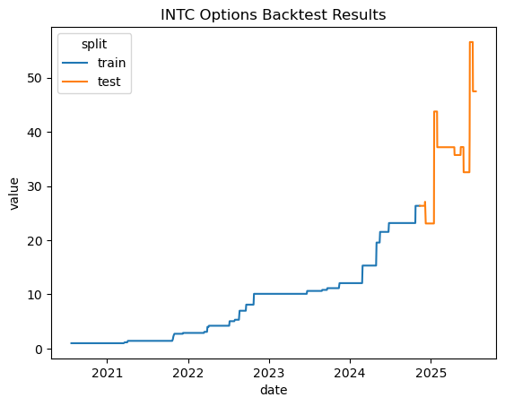
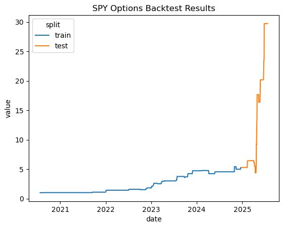

# Options Portfolio Optimization

I'm still working on the full writeup, but I've summarized some of the key accomplishments of this project below:

- Goal was to become more familiar with financial data and some of the tools required for working with it through an options portfolio optimizer

- Computed greeks and other features for models to use

- Attempted to use multiple linear regression, but I wasn't able to get the results I wanted

- Switched the task to classification and the model to XGBoost with much better success

- Built an optimizer that allocates a more statistically diverse portfolio

- Ran some preliminary backtests without much tuning and got lucky with my guessed parameters for some symbols

    - _**INTC (Intel Corporation)**_

        **Final Cumulative Return:** 4646.27%

        **Annualized Sharpe Ratio:** 1.83

        
    
    - _**SPY (S&P 500 ETF)**_

        **Final Cumulative Return:** 2872.18%

        **Annualized Sharpe Ratio:** 1.99

        

- A few things I'm still working on
    
    - Correct handling of buy/sell prices instead of just using mid price as the approximation (this likely noticably reduces the returns, but hopefully not by too much)

    - Might be good to explore a bigger optimizer that can also manage options for different stocks
